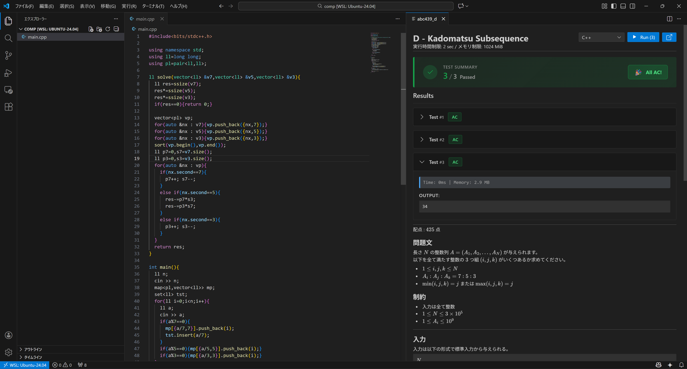

# Paiza Runner

Run code directly from VS Code using the [Paiza.io](https://paiza.io/) online compiler.

## screenshot

## Features

- **One-click execution** - Run your code without leaving VS Code
- **30+ languages supported** - Python, JavaScript, C, C++, Java, Go, Rust, and more
- **Auto language detection** - Automatically selects language based on file type
- **Standard input support** - Provide stdin data through the GUI
- **Live results** - View stdout, stderr, execution time, and memory usage

## Usage

1. Open any source code file
2. Press `Ctrl+Alt+P` (or `Cmd+Alt+P` on Mac) or run command **"Paiza Runner: Run Code"**
3. Select language (auto-detected) and enter stdin if needed
4. Click **Run Code**

## Supported Languages

`Python 3` `Python 2` `JavaScript` `TypeScript` `C` `C++` `C#` `Java` `Kotlin` `Scala` `Swift` `Go` `Rust` `Ruby` `PHP` `Perl` `Bash` `R` `Haskell` `Erlang` `Elixir` `Clojure` `F#` `Visual Basic` `COBOL` `D` `Scheme` `Common Lisp` `CoffeeScript` `Objective-C` `MySQL` `なでしこ` `Brainfuck`

## Requirements

- VS Code 1.104.0 or higher
- Internet connection (uses Paiza.io API)

## License

MIT

---

# Paiza Runner

[Paiza.io](https://paiza.io/) のオンラインコンパイラを使用して、VS Code から直接コードを実行できる拡張機能です。

> AtCoder の表示言語を日本語に設定するには VS Code の設定メニューから 拡張機能 > Paiza Runner > AtCoder Language で`Japanese`を選択してください。

## 機能

- **ワンクリック実行** - VS Code を離れずにコードを実行
- **30 以上の言語に対応** - Python, JavaScript, C, C++, Java, Go, Rust など
- **言語自動検出** - ファイルの種類から自動的に言語を選択
- **標準入力対応** - GUI から stdin データを入力可能
- **リアルタイム結果表示** - stdout, stderr, 実行時間, メモリ使用量を表示

## 使い方

1. ソースコードファイルを開く
2. `Ctrl+Alt+P`（Mac: `Cmd+Alt+P`）を押すか、コマンド **"Paiza Runner: Run Code"** を実行
3. 言語を選択（自動検出済み）し、必要に応じて標準入力を入力
4. **Run Code** をクリック

## 対応言語

`Python 3` `Python 2` `JavaScript` `TypeScript` `C` `C++` `C#` `Java` `Kotlin` `Scala` `Swift` `Go` `Rust` `Ruby` `PHP` `Perl` `Bash` `R` `Haskell` `Erlang` `Elixir` `Clojure` `F#` `Visual Basic` `COBOL` `D` `Scheme` `Common Lisp` `CoffeeScript` `Objective-C` `MySQL` `なでしこ` `Brainfuck`

## 必要条件

- VS Code 1.104.0 以上
- インターネット接続（Paiza.io API を使用）

## ライセンス

MIT
